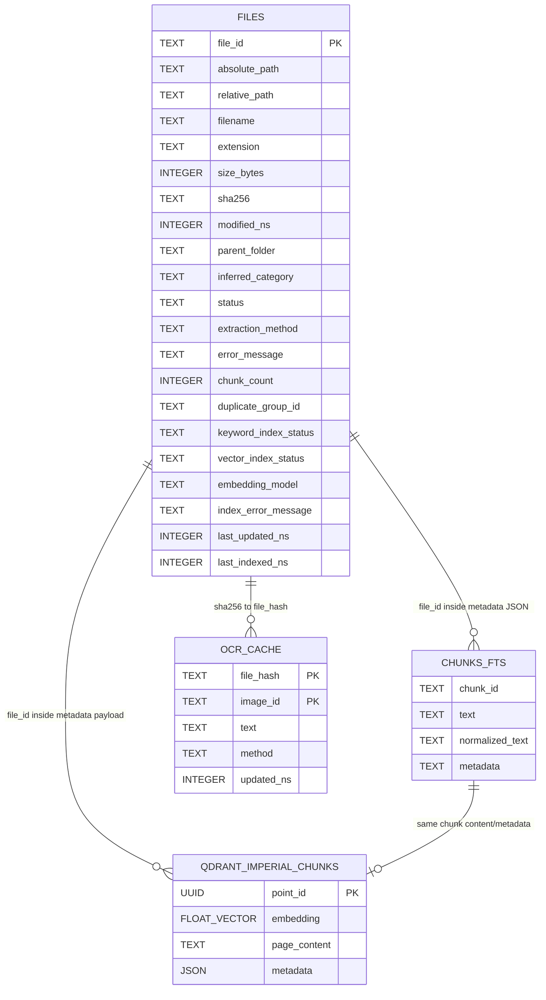
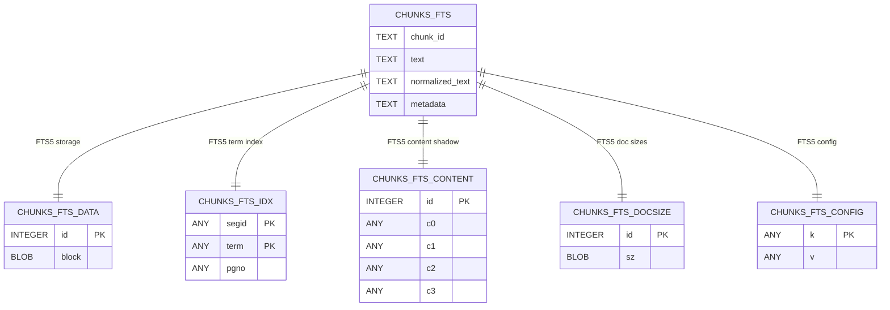
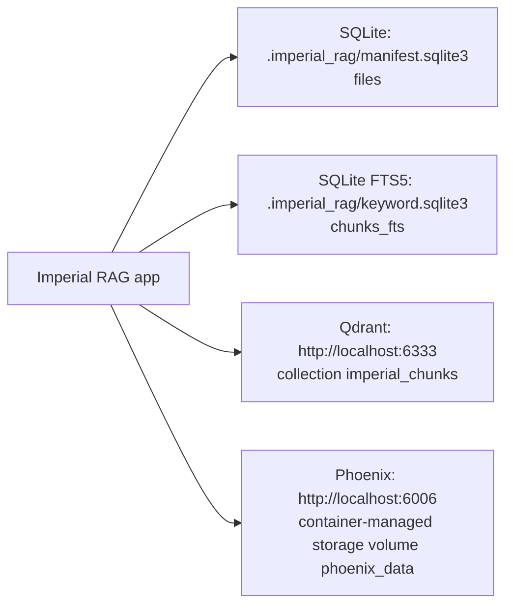

# Imperial RAG Database Schema Diagram

Generated from the live workspace on 2026-06-03.

## Live Local Databases

| Database | Path | Tables | Current rows |
| --- | --- | --- | --- |
| Manifest SQLite | `.imperial_rag/manifest.sqlite3` | `files` | 162 files |
| Keyword SQLite FTS | `.imperial_rag/keyword.sqlite3` | `chunks_fts` plus FTS5 internal tables | 970 chunks |

The `documents/**/Thumbs.db` files are Windows thumbnail artifacts, not project databases.

## App-Owned Schema



Notes:

- `FILES` is the manifest table for scanned corpus files.
- `CHUNKS_FTS` is the searchable SQLite FTS5 table. Its `metadata` column is JSON containing chunk/file citation metadata.
- `QDRANT_IMPERIAL_CHUNKS` is the configured Qdrant collection name from `QDRANT_COLLECTION`, defaulting to `imperial_chunks`. Qdrant was not running during this check, so this is the configured application shape rather than a live collection dump.
- `OCR_CACHE` is code-defined as `.imperial_rag/ocr_cache.sqlite3`, but that file does not currently exist in this workspace.

## Keyword FTS5 Internal Tables

SQLite FTS5 creates implementation tables behind `chunks_fts`. These are part of the live keyword database, but application code should treat `chunks_fts` as the public table.



## Chunk Metadata Payload

The `chunks_fts.metadata` JSON and Qdrant document metadata carry chunk citation fields. In the current generated chunk artifact, every chunk has:

```text
chunk_id
chunk_index
citation_id
duplicate_group_id
file_extension
file_hash
file_id
file_name
file_path
inferred_category
parent_folder
relative_path
source_type
```

Additional metadata can appear for source-specific extraction:

```text
sheet_name
page_number
render_dpi
image_index
embedded_media_name
image_hash
ocr_method
ocr_cached
```

In the current `.imperial_rag/extracted/chunks.jsonl`, only `sheet_name` appears among those optional fields.

## Service Databases



Qdrant and Phoenix were not running on localhost during this check, so their internal live schemas were not inspected.
