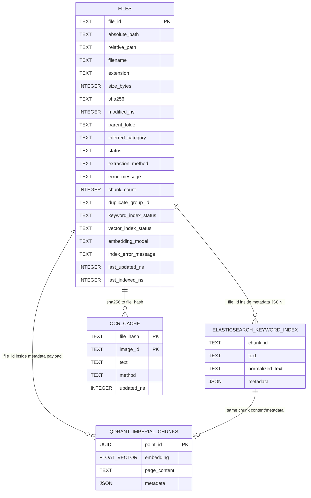
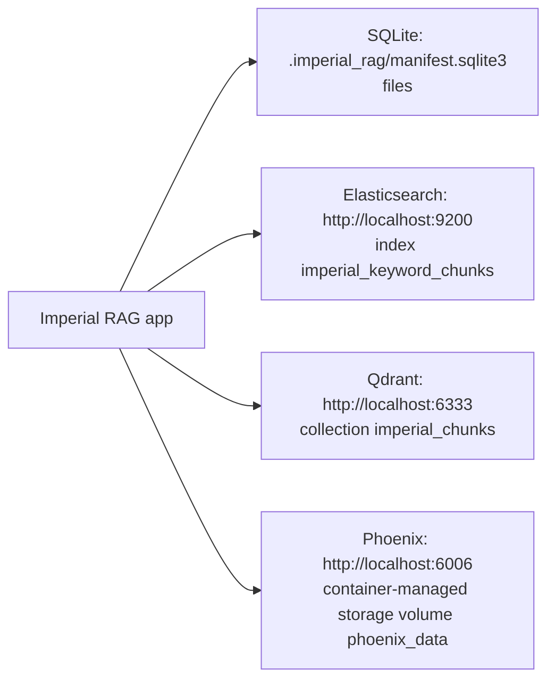

# Imperial RAG Database Schema Diagram

Generated from the live workspace on 2026-06-03; updated for the Elasticsearch keyword migration on 2026-06-11.

## Live Local Data Surfaces

| Surface | Location | Shape | Notes |
| --- | --- | --- | --- |
| Manifest SQLite | `.imperial_rag/manifest.sqlite3` | `files` | File discovery, extraction, chunk-count, and index-status ledger |
| OCR cache SQLite | `.imperial_rag/ocr_cache.sqlite3` | `ocr_cache` | Created only when OCR runs |
| Keyword Elasticsearch | `ELASTICSEARCH_URL`, default `http://localhost:9200` | `ELASTICSEARCH_INDEX`, default `imperial_keyword_chunks` | Required keyword-search service |
| Qdrant vectors | `QDRANT_URL`, default `http://localhost:6333` | `QDRANT_COLLECTION`, default `imperial_chunks` | Semantic vector-search service |

The `documents/**/Thumbs.db` files are Windows thumbnail artifacts, not project databases.

## App-Owned Schema



Notes:

- `FILES` is the manifest table for scanned corpus files.
- `ELASTICSEARCH_KEYWORD_INDEX` is the keyword-search index. Ingestion rebuilds it from `.imperial_rag/extracted/chunks.jsonl`; the old `.imperial_rag/keyword.sqlite3` file is obsolete generated state and is not read by the app.
- `QDRANT_IMPERIAL_CHUNKS` is the configured Qdrant collection name from `QDRANT_COLLECTION`, defaulting to `imperial_chunks`.
- `OCR_CACHE` is code-defined as `.imperial_rag/ocr_cache.sqlite3`.

## Chunk Metadata Payload

The Elasticsearch keyword document metadata and Qdrant document metadata carry chunk citation fields. In the current generated chunk artifact, every chunk has:

```text
chunk_id
chunk_index
citation_id
duplicate_group_id
file_extension
file_hash
file_id
file_name
file_path
inferred_category
parent_folder
relative_path
source_type
```

Additional metadata can appear for source-specific extraction:

```text
sheet_name
page_number
render_dpi
image_index
embedded_media_name
image_hash
ocr_method
ocr_cached
```

In the current `.imperial_rag/extracted/chunks.jsonl`, only `sheet_name` appears among those optional fields.

## Service Databases



Elasticsearch, Qdrant, and Phoenix are local services; their internal live schemas are not represented as SQLite files in `.imperial_rag/`.
