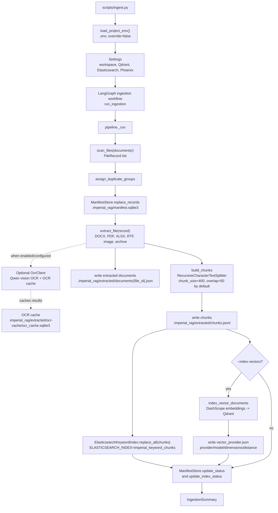
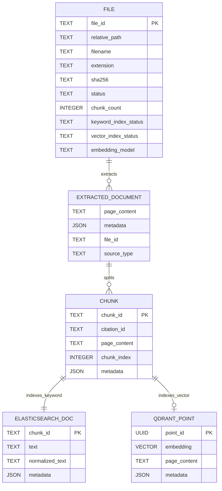

# Imperial RAG Pipeline Schema

Generated from the current checkout on 2026-06-19.

## Current Local Snapshot

| Item | Current value |
| --- | --- |
| Chunk artifact | `.imperial_rag/extracted/chunks.jsonl` |
| Current chunk count | `2470` |
| Manifest DB | `.imperial_rag/manifest.sqlite3` |
| Indexed manifest rows | `103` files with keyword and vector indexes marked `indexed` |
| Non-indexed manifest rows | `23` failed, `23` no-text, `11` unsupported, `2` manifest-only |
| Vector metadata | `dashscope`, `text-embedding-v4`, `2048` dimensions, cosine distance |
| Keyword search backend | Elasticsearch index `imperial_keyword_chunks` |
| Vector search backend | Qdrant collection `imperial_chunks_qwen` |
| Default model provider | Qwen/DashScope for chat, embeddings, OCR, and reranking |

The old `.imperial_rag/keyword.sqlite3` file may still exist as generated state from the earlier SQLite keyword path, but current ingestion and runtime code use `ElasticsearchKeywordIndex`.

## Ingestion Pipeline



## Query Pipeline

```mermaid
flowchart TD
    query_cli["scripts/query.py or Streamlit UI"]
    load_env["load_project_env()\n.env, override=false"]
    runtime["create_runtime(Settings)"]
    deps["build_query_dependencies"]
    graph["LangGraph query workflow"]

    normalize["normalize_query"]
    retrieve["retrieve node"]
    vector_gate{"DashScope configured\nand vector metadata matches?"}
    qdrant["QdrantVectorStore\nMMR search"]
    noop_vector["Noop or provider-mismatch vector search"]
    es["ElasticsearchKeywordIndex.search_with_scores"]
    hybrid["HybridRetriever\nvector candidates + keyword candidates"]
    merge["CandidateMerger\ndedupe by citation/chunk/content"]
    rrf["RrfCandidateFusion\nIMPERIAL_RAG_RRF_K"]
    rerank["Reranker\nDashScope qwen3-rerank or deterministic fallback"]
    evidence["final evidence\nreranked list"]
    prompt["build_strict_messages\nshort citations [S1], [S2], ..."]
    chat["Qwen ChatQwen\nqwen3.7-plus by default"]
    validate["validate_citations"]
    result["answer, citations, sources,\nretrieval diagnostics"]

    query_cli --> load_env --> runtime --> deps --> graph
    graph --> normalize --> retrieve
    retrieve --> vector_gate
    vector_gate -- yes --> qdrant --> hybrid
    vector_gate -- no --> noop_vector --> hybrid
    retrieve --> es --> hybrid
    hybrid --> merge --> rrf --> rerank --> evidence
    evidence --> prompt --> chat --> validate --> result
```

## Data Shape



## Chunk Metadata Contract

Every chunk is a LangChain `Document` with `page_content` and metadata. Core metadata:

```text
file_id
file_path
relative_path
file_name
file_extension
file_hash
duplicate_group_id
parent_folder
inferred_category
source_type
chunk_index
citation_id
chunk_id
```

Source-specific metadata can include:

```text
page_number
sheet_name
image_index
embedded_media_name
image_hash
ocr_method
ocr_cached
render_dpi
```

`citation_id` is built from relative path, source type, source locator, and chunk index. `chunk_id` is stable across runs for the same source identity plus content, and Qdrant point IDs are UUIDs derived from the same citation/content payload.

## Retrieval Diagnostics Schema

The query result includes a `retrieval` dictionary with these important fields when available:

```text
vector_candidates
keyword_candidates
vector_search_status
keyword_search_status
fallbacks
merged_candidates
fusion
fusion_rrf_k
fused_candidates
rerank_input_candidates
rerank_input
reranker
reranked_candidates
final_evidence
```

`final_evidence` currently means the reranked evidence list. There is no separate neighbor expansion or final selection pass after reranking.

## Operational Gates

| Gate | Effect |
| --- | --- |
| `DASHSCOPE_API_KEY` missing | Runtime uses no-op semantic search, Qwen chat/rerank calls fail or fall back where guarded |
| `.imperial_rag/vector_provider.json` missing or mismatched | Runtime marks vector search as provider-mismatch instead of querying Qdrant |
| Qdrant down | Vector search becomes unavailable/no-op through runtime guards |
| Elasticsearch down | Ingestion keyword indexing fails; runtime retrieval reports keyword search unavailable |
| Phoenix down | Tracing is skipped unless explicitly enabled or reachable |

## Runtime Provider Defaults

Qwen/DashScope is the current default provider surface:

```text
DASHSCOPE_API_KEY
IMPERIAL_RAG_QWEN_CHAT_MODEL=qwen3.7-plus
IMPERIAL_RAG_QWEN_VISION_MODEL=qwen-vl-ocr-2025-11-20
IMPERIAL_RAG_QWEN_EMBEDDING_MODEL=text-embedding-v4
IMPERIAL_RAG_QWEN_EMBEDDING_DIMENSIONS=2048
IMPERIAL_RAG_QWEN_RERANK_MODEL=qwen3-rerank
```

Legacy OpenAI/Cohere compatibility paths are opt-in escape hatches only. The runtime uses `DASHSCOPE_API_KEY` to decide whether semantic search and hosted reranking can run, and it refuses to query Qdrant when `.imperial_rag/vector_provider.json` does not match the configured embedding provider metadata.
