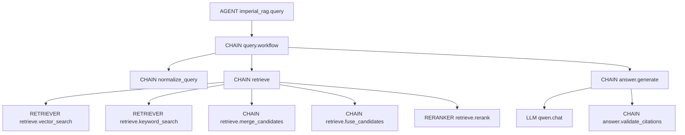

# Phoenix Domain Tracing Design

## Context

Imperial already sends Phoenix/OpenInference traces through `src/imperial_rag/tracing.py`.
The current trace tree is technically useful, but it still exposes framework-shaped spans from
LangGraph/LangChain and does not make the final Qwen model call as clear as the Phoenix tutorial
example. The goal is to make traced query and eval runs read like the domain pipeline:



## Scope

This first pass covers:

- Streamlit query answering through the existing runtime.
- `scripts/query.py` traced runs.
- Phoenix eval runs through `scripts/run_phoenix_eval.py` and `scripts/run_all_evals.py`, so each
  evaluated question gets the same domain-shaped query trace.

It does not redesign ingestion, corpus indexing, OCR, or embedding batch tracing beyond preserving
their current behavior.

## Approach

Use manual domain instrumentation for query/eval runs instead of relying on framework spans to tell
the story. Phoenix auto-instrumentation can stay available for dependency coverage, but Imperial's
query path should emit the domain spans above and wrap the LangGraph workflow invocation in Phoenix's
`suppress_tracing` context when that context is available. If `suppress_tracing` is unavailable, the
domain spans still remain the supported trace shape and implementation tests should not require
framework spans to be absent.

This mirrors the Phoenix "Your First Traces" pattern: one parent `AGENT` span wraps the user request,
and all retrieval, rerank, generation, validation, and model operations run under that active context.

## Span Semantics

The root `imperial_rag.query` span remains an `AGENT` span. It stores the user question, final answer,
citation validity, evidence count, and summary retrieval diagnostics.

The `query.workflow` span is a `CHAIN` span. It groups the domain workflow independently from LangGraph
implementation details.

The `retrieve` span is a `CHAIN` span. It groups vector search, keyword search, candidate merge, RRF
fusion, and reranking.

The search spans remain `RETRIEVER` spans with OpenInference retrieval document attributes. The rerank
span remains a `RERANKER` span with input and output document attributes.

The `answer.generate` span remains a `CHAIN` span. It contains the provider model call and citation
validation. When no evidence is available, it returns the existing refusal behavior without creating a
fake model call.

The new `qwen.chat` span is an `LLM` span. It should include:

- `llm.model_name` and `llm.provider`.
- `llm.invocation_parameters` as JSON.
- `llm.input_messages.{i}.message.role` and `.content`.
- `llm.output_messages.{i}.message.role` and `.content`.
- token count attributes when the provider response exposes them.

## Data And Privacy

Retrieval and rerank spans preserve the current bounded behavior:

- only a limited number of documents are attached;
- document content is truncated;
- document metadata is allowlisted unless explicitly overridden;
- existing OpenInference hide flags continue to hide input/output/document text.

The `qwen.chat` span should show prompt messages by default, but message content must be bounded by
`IMPERIAL_RAG_TRACE_MESSAGE_CONTENT_CHARS`, defaulting to 2,000 characters per message. Existing flags,
including `OPENINFERENCE_HIDE_INPUTS`, `OPENINFERENCE_HIDE_OUTPUTS`, and message-specific OpenInference
hide flags, should be respected so private corpus text can be suppressed without code changes.

## Code Changes

In `src/imperial_rag/tracing.py`:

- add an `LLM` span helper;
- add helpers for flattened OpenInference message attributes;
- add bounded message-content handling;
- add a small suppression context for framework spans around domain-traced sections if the Phoenix
  package exposes `suppress_tracing`.

In `src/imperial_rag/runtime.py`:

- keep `imperial_rag.query` as the root span;
- add `query.workflow` around workflow invocation;
- keep output summaries on the root span.

In `src/imperial_rag/retrieval.py`:

- add the `retrieve` grouping span;
- keep existing vector, keyword, merge, fuse, and rerank spans as children;
- preserve current document preview and OpenInference document attributes.

In `src/imperial_rag/workflows.py`:

- keep `answer.generate` and `answer.validate_citations`;
- wrap the provider chat invocation in `qwen.chat` when Imperial owns the generation call;
- preserve compatibility with test fakes and injected generators.

In `scripts/run_phoenix_eval.py` and `scripts/run_all_evals.py`:

- preserve existing Phoenix dataset and experiment behavior;
- ensure eval targets use the same runtime query path as normal query answering.

## Error Handling

Tracing must not break answering. If Phoenix is unavailable and tracing was enabled implicitly by
environment, the current skip behavior should remain. If tracing was explicitly enabled and a Phoenix
dependency is missing, keep the clear setup error.

Runtime exceptions inside traced blocks should still set span error status and record exception details
before re-raising. Failures in optional span enrichment should be defensive and should not change the
query answer.

## Testing

Add focused unit tests for:

- `LLM` span helper attributes, message truncation, and hide-flag behavior;
- `query.workflow` nesting calls from `Runtime.query`;
- the `retrieve` grouping span and existing retrieval child spans;
- answer generation creating a `qwen.chat` span with model, messages, and output;
- eval scripts continuing to route through the same runtime query path.

Run targeted tests first:

```bash
uv run python -m pytest tests/test_tracing.py tests/test_runtime.py tests/test_workflows.py tests/test_retrieval.py tests/test_evals.py -q
```

For live verification, run one traced query against the local stack and inspect Phoenix at
`http://127.0.0.1:6006` for the domain tree and Qwen message panel.
